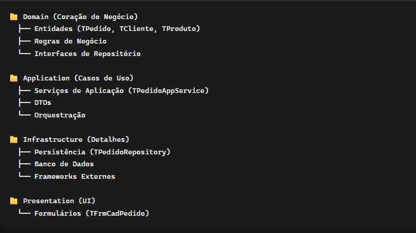
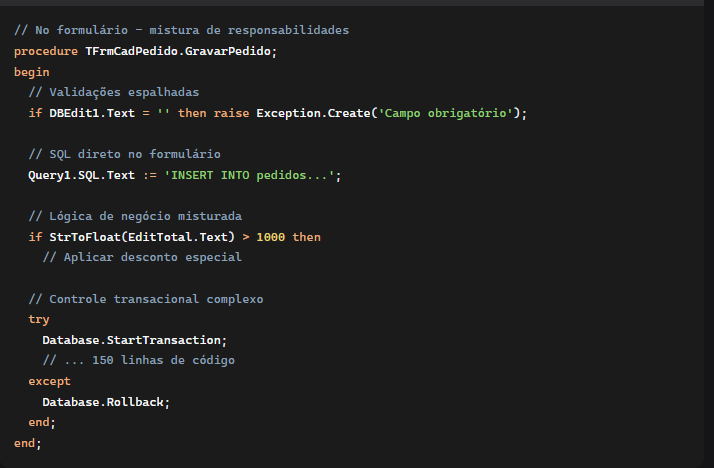
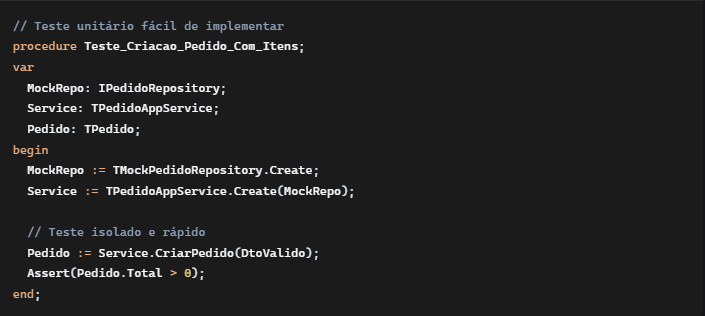
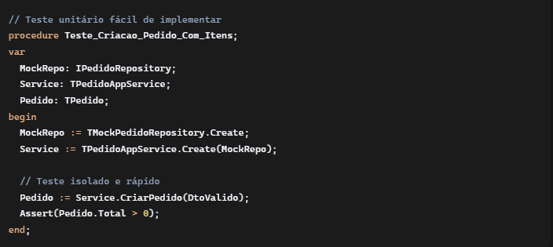

Transformação Arquitetural do Módulo de Pedidos: Uma Jornada do Código Legado para a Excelência em Software
Introdução: O Desafio do Código Legado
Quando nos deparamos com o módulo de Pedidos em sua versão original, encontramos um cenário comum em muitos projetos Delphi: um formulário que centralizava todas as responsabilidades - interface com usuário, regras de negócio, acesso a dados e validações. Este approach, conhecido como "God Class", trazia consigo todos os problemas de maintainabilidade, testabilidade e escalabilidade que comprometem a evolução de um software.

A Metamorfose: Princípios Aplicados
DDD (Domain-Driven Design): Colocando o Domínio no Centro
A primeira grande transformação foi a descoberta do domínio de negócio. Em vez de pensarmos em "tabelas do banco", passamos a modelar entidades de negócio:

TPedido deixou de ser um registro de banco para se tornar uma entidade rica com comportamentos

TPedidoItem ganhou autonomia com validações próprias

TCliente e TProduto tornaram-se cidadãos de primeira classe no domínio

Criamos agregados que garantem a consistência das transações de negócio. Um pedido agora é um agregado raiz que gerencia seus itens, garantindo que regras críticas (como estoque mínimo e validade de produtos) sejam respeitadas.

Arquitetura Limpa: A Organização em Camadas
Implementamos a Clean Architecture com camadas bem definidas:

A regra de dependência foi rigorosamente aplicada: dependências apontam apenas para dentro, do exterior para o centro. O domínio não conhece ninguém - é a camada mais estável e protegida.

SOLID: Os Pilares da Manutenibilidade
Cada princípio SOLID foi meticulosamente aplicado:

Single Responsibility: O formulário TFrmCadPedido agora cuida apenas da UI. Cada classe tem uma razão única para mudar.

Open/Closed: Nossas interfaces estão fechadas para modificação, mas abertas para extensão. Podemos adicionar novos repositórios ou estratégias de validação sem alterar código existente.

Liskov Substitution: Qualquer implementação de IPedidoRepository pode ser substituída por outra sem quebrar o sistema.

Interface Segregation: Interfaces específicas e focadas, ao invés de uma interface geral que força implementações desnecessárias.

Dependency Inversion: Dependemos de abstrações, não de implementações concretas. A injeção de dependências via constructor garante baixo acoplamento.

Exemplos Práticos da Transformação
Antes: O Monólito

Depois: Arquitetura Limpa

Benefícios Tangíveis da Nova Arquitetura
1. Testabilidade Explosiva
Antes, testar o módulo de pedidos era praticamente impossível. Agora:

2. Manutenibilidade Radical
 - Bugs são localizados rapidamente: Cada responsabilidade está contida

 - Mudanças são seguras: Modificações em uma camada não afetam outras

 - Novos desenvolvedores entendem rápido: A arquitetura é intuitiva

3. Evolução Contínua
Podemos evoluir partes do sistema independentemente:

Trocar o banco de dados? Apena a camada de Infrastructure é afetada

Adicionar nova UI (Web/Mobile)? Reutilizamos Application e Domain

Implementar cache? Criamos um decorator para o repositório

4. Resilência a Mudanças
Quando requisitos mudam (e sempre mudam!), a arquitetura absorve o impacto:

Novas regras de negócio → Domain Layer

Novos fluxos de UI → Presentation Layer

Novas integrações → Infrastructure Layer

Lições Aprendidas e Melhores Práticas
Padrões que se Provaram Essenciais
Factory Pattern: Para criação complexa de entidades

Repository Pattern: Para abstração da persistência

Strategy Pattern: Para algoritmos intercambiáveis (validações, cálculos)

Singleton Pattern: Para recursos globais como conexão de banco

Dependency Injection: Para baixo acoplamento

Boas Prisas Consolidadas
Nomenclatura expressiva: Código que se explica

Funções pequenas: Métodos com uma única responsabilidade

Tratamento adequado de exceções: Erros como cidadãos de primeira classe

Gerenciamento rigoroso de memória: Destruição ordenada e segura

O Impacto no Dia a Dia do Desenvolvimento
Para os desenvolvedores:

Menos tempo debugando, mais tempo implementando features

Confiança para fazer refatorações

Clareza sobre onde cada código deve morar

Para o negócio:

Entregas mais rápidas e previsíveis

Menos bugs em produção

Sistema preparado para escalar

Para a equipe:

Onboarding acelerado de novos membros

Código review mais eficiente

Conhecimento compartilhado através da arquitetura

Conclusão: Mais do que Código, uma Mudança de Mentalidade
A refatoração do módulo de Pedidos foi muito mais do que uma simples reescrita de código. Foi uma mudança de paradigma na forma como encaramos o desenvolvimento de software.

Passamos de uma mentalidade de "fazer funcionar" para uma cultura de "fazer certo". De código que apenas funciona para código que comunica, evolui e sustenta.

Este módulo se tornou não apenas um exemplo técnico, mas um farol arquitetural para todo o sistema. Demonstra que é possível aplicar princípios modernos de engenharia de software em projetos Delphi, unindo a robustez da plataforma com a elegância de arquiteturas limpas.

A jornada continua, mas agora temos fundações sólidas para construir um software que não apenas atende às necessidades de hoje, mas que está preparado para os desafios de amanhã.

"Arquitetura de software não é sobre fazer coisas funcionarem; é sobre fazer coisas durarem."