# Cadastro de Clientes, Produtos, Pedidos e Itens de Pedido

## Treinamento técnico Delphi DDD 

# 🚀 TreinamentoDDD

> 📝 Cadastro de clientes produtos e pedidos
Permite a inclusao de clientes, produtos e pedidos com seus respectivos itens. Permite a emissão de relatorios por periodo, bem como o agrupamento dos X mais itens vendidos.

---

## 📌 Índice
- [Sobre](#-sobre)
- [Tecnologias](#-tecnologias)
- [Estrutura do Projeto](#-estrutura-do-projeto)
- [Instalação e Uso](#-instalação-e-uso)
- [Commits e Versionamento](#-commits-e-versionamento)
- [Roadmap](#-roadmap)
- [Screenshots](#-screenshots)
- [Autor](#-autor)
- [Licença](#-licença)

---

## 📖 Sobre
Este projeto é uma migração para DDD de uma aplicação Delphi, desenvolvida como forma de desafio técnico para o processo seletivo para uma vaga de programador Delphi. 
A aplicação permite a criação de cadastros de Clientes e Produtos, registra o movimento de pedidos, possibilitando a inclusão, alteração 
e exclusão de pedidos e seus respectivos itens,  além da pesquisas diversas e interativas, através de uma interface de pequisa, permitindo a navegação entre registros, exibindo ou atualizando os dados armazenados no banco de dados, além de emissão de relatórios de vendas.

---

## 🛠 Tecnologias
As principais ferramentas utilizadas neste projeto são:

- **Delphi 10.1 Berlin / RAD Studio**
- **MSSQL Server** (Banco de dados)
- **Firedac /  ClientDataSet**
- **API para consumo ViaCep** (para consultas de CEP)
- **Git & GitHub** (versionamento e controle de commits)
---

📋 Relatório de Migração para DDD - Módulo de Clientes

📝 Índice
1.	Visão Geral da Migração
2.	Nova Estrutura de Pastas e Classes
3.	Ganhos com a Migração para DDD
4.	Princípios SOLID Aplicados
5.	Clean Code Aplicado
6.	Clean Architecture Implementada
7.	DDD em Ação - Exemplos Práticos
8.	Benefícios das Mudanças
9.	Resultado Final
________________________________________
🎯 Visão Geral da Migração

Migramos de uma arquitetura MVC tradicional para Domain-Driven Design (DDD) com princípios SOLID e Clean Code e Clean Architecture.
Objetivos principais:

-	Separar claramente as responsabilidades
- Proteger as regras de negócio
-	Melhorar a testabilidade
-	Facilitar a manutenção e evolução do sistema
________________________________________
🏗️ Nova Estrutura de Pastas e Classes

📁 Estrutura de Pastas:

    |domain/                              # Camada de Domínio
    |   |── exceptions/                   # Excessões da classe
    |   |── models/                       # Modelos de entidades
    |   |── repositories/                 # Interfaces dos repósitorios
    |   |── services/                     # Interfaces de serviços
    |   └── valueobjects/                 # Objetos de Valor
    │── Infrastructure/                   # Camada de Infraestrutura
    |   |── persistence/                  # SubCamada de persistência
    |   |   |── databases/                # Classes de conexões ao BD
    |   |   |── mappings/                 # Mapeamento de Classes
    |   |   |── repositories              # Classes de Persistência
    |   |   └── services/                 # Classes de aceesso a serviços
    |   └── services/                     # API´s de serviços
    |── Application/                      # Camada de aplicação
    |   |── mappers/                      # Mapeamento de classes
    |   |── DTOs/                         # Objetos de transferência de dados
    |   └── Services/                     # Serviços da aplicação (APP Service)
    |── Presentation/                     # Camada de Apresentação
    |   |── forms/                        # Formulários
    |   |   |── base/                     # Formulários padrão
    |   |   |── clientes/                 # Formulários de clientes
    |   |   |── main/                     # Formulário principal
    |   |   |── pedidos/                  # Formulários de pedidos
    |   |   |── produtos/                 # Formulários produtos
    |   |   |── relatorios/               # Formulários de relatórios
    |   └── Controllers/                  # Controladores UI
    |── shared/                           # Camada Compartilhada
    |   |── constants/                    # 
    |   |── types/                        # 
    |   └── Utils/                        # Rotinas de formatações e validações
    └── CrossCutting                      # Concerns Transversais
        |── IoC/                          # Inversão de controle
        └── Logging/                      # Logging

📋 Exemplo de classes:
| Classe             | Responsabilidade                          | Camada          |
|---------------------|-------------------------------------------|-----------------|
| **TCliente**        | Entidade principal com regras de negócio  | Domain          |
| **TEndereco**       | Value Object para dados de endereço       | Domain          |
| **TContato**        | Value Object para dados de contato        | Domain          |
| **TDocumento**      | Value Object para dados documentais       | Domain          |
| **TClienteDTO**     | Transferência de dados entre camadas      | Application     |
| **TClienteService** | Coordenação e regras de aplicação         | Application     |
| **TClienteRepository** | Persistência e acesso a dados          | Infrastructure  |
| **TValidadores**    | Validações reutilizáveis                  | Application     |
________________________________________
## 🚀 Ganhos com a Migração para DDD

✅ 1. Separação Clara de Responsabilidades  
Antes: Lógica misturada nos Forms  
Depois: Cada classe com responsabilidade única 

✅ 2. Manutenibilidade Melhorada
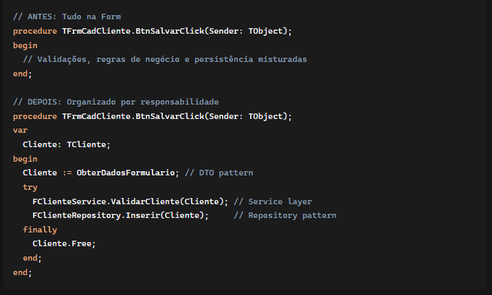

✅ 3. Testabilidade
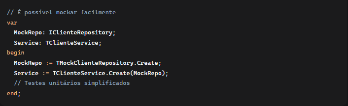

🧩 Princípios SOLID Aplicados
1. ✅ Single Responsibility Principle

Antes:

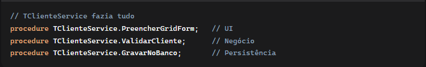

Depois:

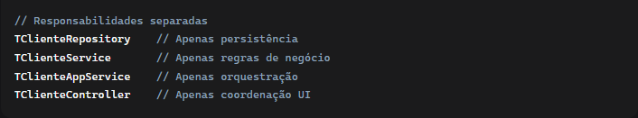

2. ✅ Open/Closed Principle

Antes:

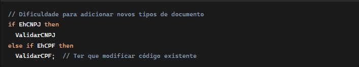

Depois:

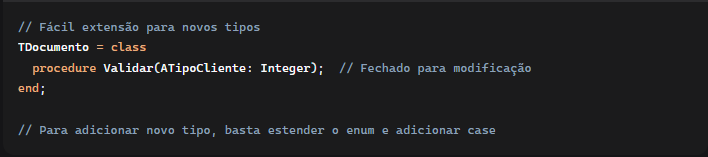

3. ✅ Liskov Substitution Principle

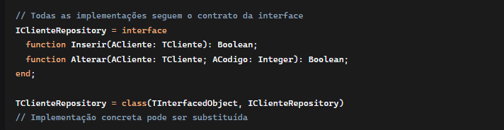

4. ✅ Interface Segregation Principle

Antes:

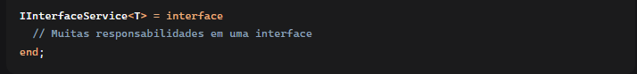

Depois

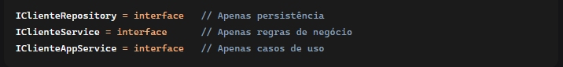

5. ✅ Dependency Inversion Principle

Antes:

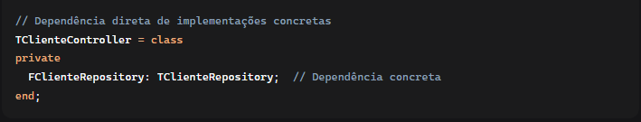

Depois:

________________________________________
🧹 Clean Code Aplicado

✅ Nomenclatura Expressiva

Antes:
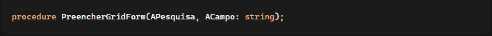

Depois:
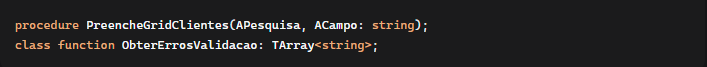

✅ Funções Pequenas e Específicas

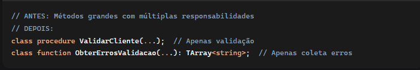

✅ Eliminação de Código Duplicado

ANTES: Validações repetidas em múltiplos lugares

DEPOIS: Validações centralizadas nos Value Objects

________________________________________
🏛️ Clean Architecture Implementada

✅ Camadas Bem Definidas

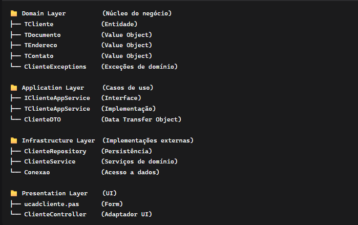

✅ Independência de Framework

![alt text]./docs/images/(image-17.png)

________________________________________
🎯 DDD em Ação - Exemplos Práticos
1. ✅ Value Objects Implemntados

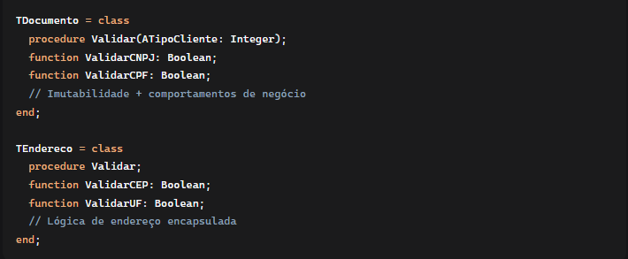

2. ✅ Agregações Claras

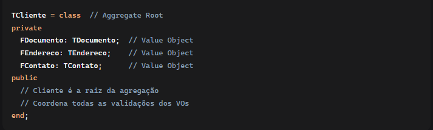
3. ✅ Linguagem Ubíqua

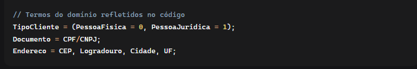

________________________________________
🚀 Benefícios das Mudanças

🛠️ Melhorias na Manutenibilidade

•	✅ Mudanças isoladas em uma classe

•	✅ Menor impacto em modificações

•	✅ Fácil localização de código

•	✅ Redução de bugs por acoplamento

🔧 Facilidade para Futuras Implementações

•	✅ Adicionar novo campo: apenas no DTO e Entity

•	✅ Nova validação: apenas no Value Object

•	✅ Novo relatório: usa DTO existente

•	✅ Múltiplos frontends: mesma camada de aplicação

📊 Organização e Clareza

•	✅ Código auto-documentado

•	✅ Estrutura previsível

•	✅ Onboarding mais rápido de novos devs

•	✅ Padrões consistentes em todo o projeto

🧪 Testabilidade Aprimorada

•	✅ Unit testing facilitado

•	✅ Mocking simplificado

•	✅ Testes de integração mais focados

•	✅ Cobertura de testes aumentada

⚡ Performance e Qualidade

•	✅ Menor acoplamento = menos bugs

•	✅ Código mais limpo = melhor performance

•	✅ Arquitetura sólida = menos technical debt
________________________________________
📈 Resultado Final

A migração transformou um código acoplado em uma arquitetura robusta onde:

1.	🔒 Regras de negócio estão protegidas no Domain

2.	🔄 Mudanças são isoladas e controladas

3.	🧪 Testes são viáveis e eficientes

4.	🚀 Novas features são implementadas rapidamente

5.	👥 Trabalho em equipe é facilitado

6.	📊 Qualidade do código é significativamente melhor

7.	🔮 Futuro do projeto é mais seguro e escalável

O DDD não é apenas uma arquitetura - é uma forma de pensar o domínio que resulta em software mais resiliente e adaptável às mudanças de negócio! 🎯

        